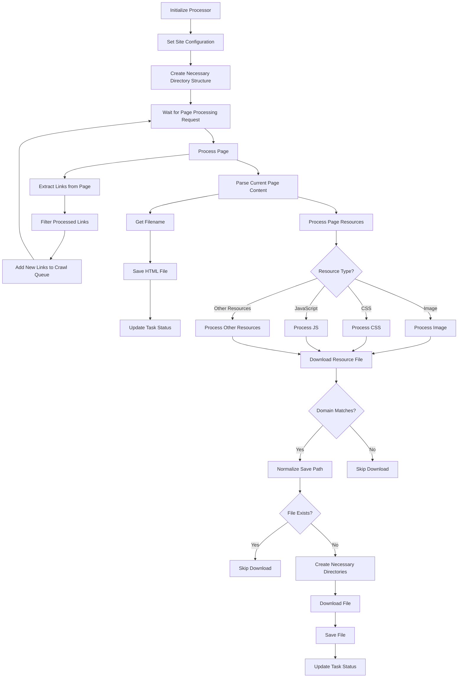

# Website Clone Service

A website cloning service based on Spring Boot and WebMagic for downloading website content and resources to local storage.
https://webclone.leoobai.cn/

## Features

- Complete website cloning support
- Configurable concurrent thread count
- Configurable retry mechanism
- Configurable request interval time
- Asynchronous task processing support
- Task status query interface
- Real-time task progress tracking
- Error handling and recovery mechanism

## Technology Stack

- Spring Boot
- WebMagic crawler framework
- HttpClient
- Lombok
- Java 8+

## Quick Start

### Prerequisites

- JDK 8 or higher
- Maven 3.6 or higher
- Spring Boot 2.x

### Build Project

```bash
cd siteclone
mvn clean install
```

### Run Service

```bash
java -jar target/siteclone-1.0.0.jar
```

## API Documentation

### 1. Start Clone Task

**Request**

```http
POST /api/clone
Content-Type: application/json

{
    "url": "https://example.com",
    "threadCount": 5,
    "retryTimes": 3,
    "sleepTime": 1000
}
```

**Parameter Description**

- `url`: Website URL to clone (required)
- `threadCount`: Concurrent thread count (optional, default: 5)
- `retryTimes`: Failed retry count (optional, default: 3)
- `sleepTime`: Request interval time in milliseconds (optional, default: 1000)

**Response**

```json
{
    "taskId": "task-123",
    "url": "https://example.com",
    "outputDir": "/path/to/output",
    "status": "PENDING",
    "createdAt": "2023-01-01T12:00:00",
    "updatedAt": "2023-01-01T12:00:00",
    "errorMessage": null,
    "pagesCrawled": 0,
    "filesDownloaded": 0
}
```

### 2. Query Task Status

**Request**

```http
GET /api/clone/{taskId}
```

**Response**

```json
{
    "taskId": "task-123",
    "url": "https://example.com",
    "outputDir": "/path/to/output",
    "status": "RUNNING",
    "createdAt": "2023-01-01T12:00:00",
    "updatedAt": "2023-01-01T12:00:05",
    "errorMessage": null,
    "pagesCrawled": 10,
    "filesDownloaded": 25
}
```

## Task Status Description

Task statuses include:

- PENDING: Task waiting to execute
- RUNNING: Task is executing
- COMPLETED: Task completed
- FAILED: Task failed

## WebsiteMirrorProcessor Business Flow



## Configuration Description

Main configuration items include:

1. Task Execution Configuration
   - threadCount: Concurrent thread count
   - retryTimes: Failed retry count
   - sleepTime: Request interval time

2. System Configuration
   - Thread pool configuration
   - Download timeout settings
   - Retry strategy
   - Resource filtering rules

## Usage Examples

### Basic Clone Task

```bash
curl -X POST http://localhost:8080/api/clone \
  -H "Content-Type: application/json" \
  -d '{
    "url": "https://example.com"
  }'
```

### Custom Configuration Clone Task

```bash
curl -X POST http://localhost:8080/api/clone \
  -H "Content-Type: application/json" \
  -d '{
    "url": "https://example.com",
    "threadCount": 10,
    "retryTimes": 5,
    "sleepTime": 2000
  }'
```

### Query Task Status

```bash
curl http://localhost:8080/api/clone/task-123
```

## Important Notes

1. Reasonably set threadCount and sleepTime to avoid excessive pressure on target servers
2. Follow target website's robots.txt rules
3. Pay attention to network bandwidth usage
4. Adjust configuration parameters based on target website scale and characteristics

## Error Handling

The system handles the following types of errors:

- Network connection errors
- Resource download failures
- Task execution timeouts
- Concurrency limit issues

For these errors, the system will:

1. Retry according to retryTimes configuration
2. Record detailed error information
3. Update task status
4. Return meaningful error messages

## Contribution Guide

1. Fork the project
2. Create a feature branch
3. Commit your changes
4. Push to the branch
5. Create a Pull Request

## License

[MIT License](LICENSE)