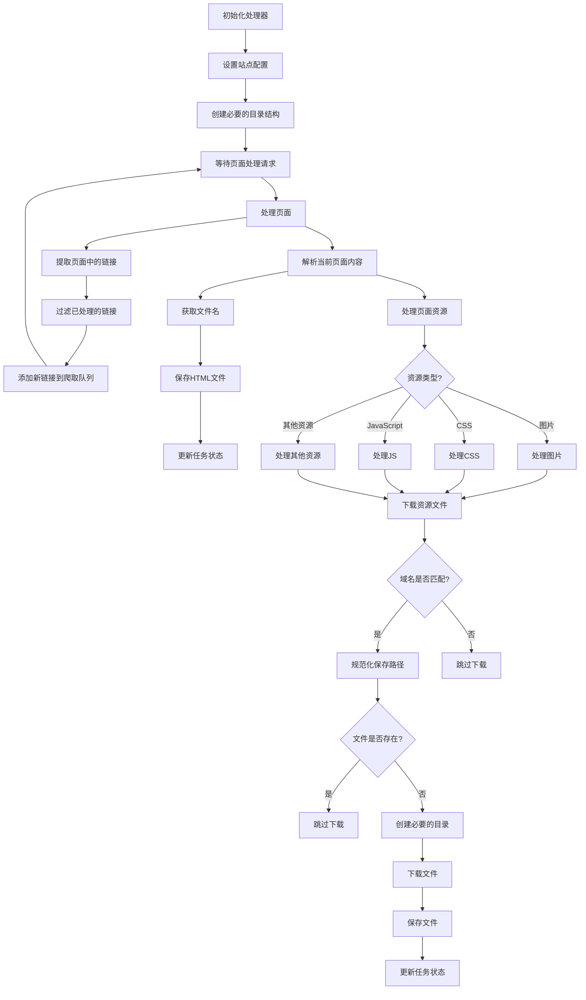

# Website Clone Service

一个基于Spring Boot和WebMagic的网站克隆服务，用于将指定网站的内容和资源下载到本地。
https://webclone.leoobai.cn/
## 功能特性

- 支持完整网站克隆
- 可配置的并发线程数
- 可配置的重试机制
- 可配置的请求间隔时间
- 支持异步任务处理
- 提供任务状态查询
- 实时任务进度追踪
- 错误处理和恢复机制

## 技术栈

- Spring Boot
- WebMagic 爬虫框架
- HttpClient
- Lombok
- Java 8+

## 快速开始

### 前置条件

- JDK 8 或更高版本
- Maven 3.6 或更高版本
- Spring Boot 2.x

### 构建项目

```bash
cd siteclone
mvn clean install
```

### 运行服务

```bash
java -jar target/siteclone-1.0.0.jar
```

## API文档

### 1. 启动克隆任务

**请求**

```http
POST /api/clone
Content-Type: application/json

{
    "url": "https://example.com",
    "threadCount": 5,
    "retryTimes": 3,
    "sleepTime": 1000
}
```

**参数说明**

- `url`: 要克隆的网站URL（必需）
- `threadCount`: 并发线程数（可选，默认值：5）
- `retryTimes`: 失败重试次数（可选，默认值：3）
- `sleepTime`: 请求间隔时间，单位毫秒（可选，默认值：1000）

**响应**

```json
{
    "taskId": "task-123",
    "url": "https://example.com",
    "outputDir": "/path/to/output",
    "status": "PENDING",
    "createdAt": "2023-01-01T12:00:00",
    "updatedAt": "2023-01-01T12:00:00",
    "errorMessage": null,
    "pagesCrawled": 0,
    "filesDownloaded": 0
}
```

### 2. 查询任务状态

**请求**

```http
GET /api/clone/{taskId}
```

**响应**

```json
{
    "taskId": "task-123",
    "url": "https://example.com",
    "outputDir": "/path/to/output",
    "status": "RUNNING",
    "createdAt": "2023-01-01T12:00:00",
    "updatedAt": "2023-01-01T12:00:05",
    "errorMessage": null,
    "pagesCrawled": 10,
    "filesDownloaded": 25
}
```

## 任务状态说明

任务状态包括：

- PENDING: 任务等待执行
- RUNNING: 任务正在执行
- COMPLETED: 任务已完成
- FAILED: 任务失败

## WebsiteMirrorProcessor 业务流程



## 配置说明

主要配置项包括：

1. 任务执行配置
   - threadCount: 并发线程数
   - retryTimes: 失败重试次数
   - sleepTime: 请求间隔时间

2. 系统配置
   - 线程池配置
   - 下载超时设置
   - 重试策略
   - 资源过滤规则

## 使用示例

### 基本克隆任务

```bash
curl -X POST http://localhost:8080/api/clone \
  -H "Content-Type: application/json" \
  -d '{
    "url": "https://example.com"
  }'
```

### 自定义配置克隆任务

```bash
curl -X POST http://localhost:8080/api/clone \
  -H "Content-Type: application/json" \
  -d '{
    "url": "https://example.com",
    "threadCount": 10,
    "retryTimes": 5,
    "sleepTime": 2000
  }'
```

### 查询任务状态

```bash
curl http://localhost:8080/api/clone/task-123
```

## 注意事项

1. 合理设置threadCount和sleepTime，避免对目标服务器造成过大压力
2. 遵守目标网站的robots.txt规则
3. 注意网络带宽使用
4. 根据目标网站的规模和特点调整配置参数

## 错误处理

系统会处理以下类型的错误：

- 网络连接错误
- 资源下载失败
- 任务执行超时
- 并发限制问题

对于这些错误，系统会：

1. 根据retryTimes配置进行重试
2. 记录详细的错误信息
3. 更新任务状态
4. 返回有意义的错误消息

## 贡献指南

1. Fork 项目
2. 创建特性分支
3. 提交更改
4. 推送到分支
5. 创建 Pull Request

## 许可证

[MIT License](LICENSE)
